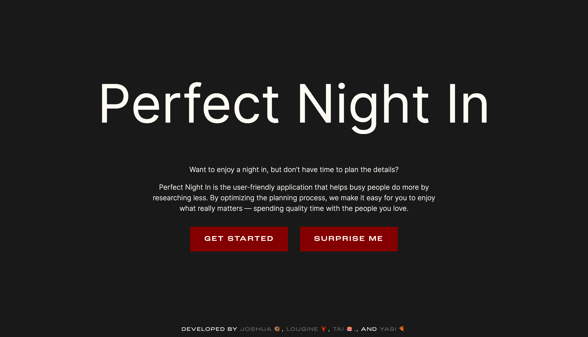
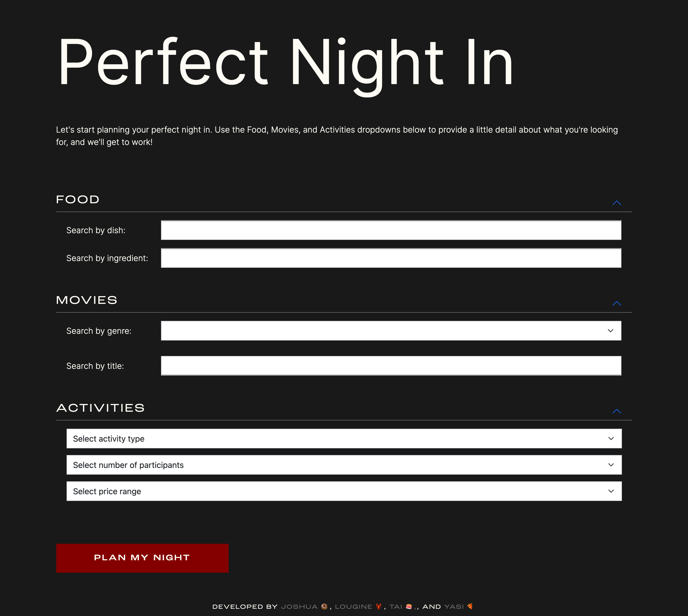

# Perfect Night In — Web Application
## Description
Perfect Night In is the user-friendly application that helps busy people do more by researching less. By optimizing the planning process, we make it easy for you to enjoy what really matters — spending quality time with the people you love. Our goal in developing the “Perfect Night In” application was to create a quick and easy way for anyone to search for food, movie, and activity options by entering a few details into a search form.

## User Story
<em>“As a busy person with limited free time, I want to access a list of food, film, and activity suggestions based on select criteria to help me plan my perfect night in.”</em>

USER GOALS:
- The user wants to find a tasty recipe that uses ingredients they define
- The user wants to find a movie to watch based on a select genre or specific title
- The user wants to find an activity based on number of participants, price, and activity type

APPLICATION SOLUTIONS:
- Incorporate an API for users to input desired ingredients and retrieve a list of recipe suggestions
- Incorporate an API for users to select genre from a dropdown or input a specific title and retrieve a list of movie suggestions
- Incorporate an API to suggest activity options 

## Technologies
We incorporated the following technologies into our application: 
- Recipe Puppy API: The Recipe Puppy API lets you search through recipe puppy database of over a million recipes by keyword and/or by search query. 
Link: www.recipepuppy.com/about/api/
- iTunes API: The iTunes API allows you to place search fields in your website to search for content within the iTunes Store and Apple Books Store. 
ink: https://affiliate.itunes.apple.com/resources/documentation/itunes-store-web-service-search-api/
- Bored API: The Bored API helps you find things to do when you're bored! There are fields like the number of participants, activity type, and more that help you narrow down your results. 
Link: https://www.boredapi.com/api/activity
- Bootstrap UI: A potent front-end framework used to create modern websites and web apps that features numerous HTML and CSS templates for UI interface elements. 
Link: https://getbootstrap.com/

## Usage
Here is a link to view the deployed application: https://go-yasi.github.io/perfect-night-in/

Below is a screenshot of the live application's home page: 

Below is a screenshot of the live application's search form: 

## Challenges
Overall, the project development process was very smooth. We were able to incorporate the APIs pretty seamlessly and worked well together as a team. The biggest challenges we faced were:
- Trying to rectify several git merge conflicts,
- API asynchronous timing issue,
- CORS API security issue,
- and positioning a stubborn footer that just wouldn’t stay at the bottom of the page!

## Future Development
Going forward, we hope to make the following updates to the application: 
- Create an option for users who don’t have search criteria to randomly generate results 
- Create an option for users who don’t want to select a movie genre or input a movie title to view a list of the top ten rated movies
- Increase the number of results that generate on the page and get them to display in a horizontal scroll
- Offer the option to generate new search results directly on the results page, by category

## Credits
The development of this application was a group effort! The following team members brought this project to life: 
Tai Mujarin: https://github.com/AyoTai
Joshua Galvez: https://github.com/joshuagalvez11
Lougine Scott: https://github.com/sclo00ps
Yasi Moshtael: https://github.com/go-yasi

## Conclusion
Overall, we were able to successfully launch this application and get all three APIs to function. We tackled every challenge as a team and supported each other's progress throughout the project cycle. 